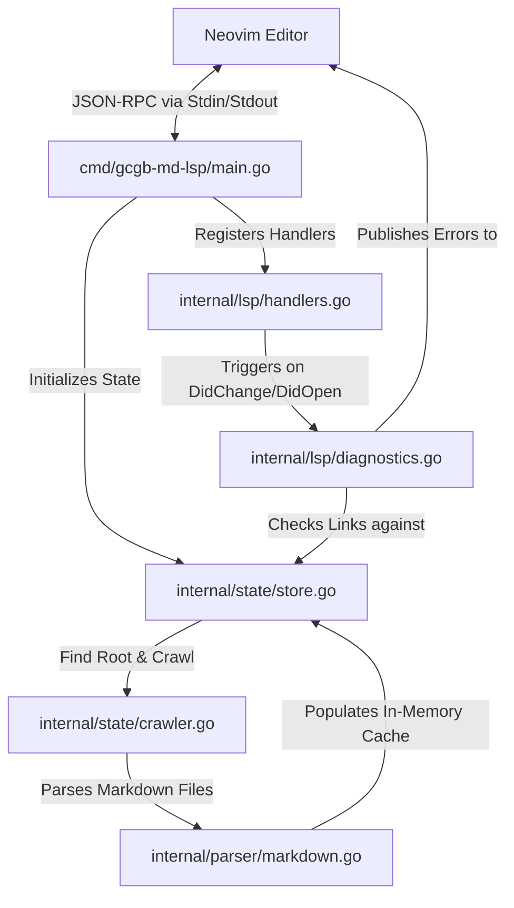

# LSP Architecture

This document describes the high-level system structure and file organization of the `gcgb-md-lsp` server.

## What is an LSP Server?

A **Language Server Protocol (LSP) server** is a background process that communicates with a client (like Neovim) using standard input and output (`stdin`/`stdout`) over **JSON-RPC** messages. It handles logic for code intelligence, definitions, folding, and diagnostics, keeping the editor interface fast and decoupled from language-specific compilers or parsers.

## Component Overview

The system is split into three main packages to isolate components:

### Module Descriptions

- **[main.go](cmd/gcgb-md-lsp/main.go)**: The entry point. Creates the server instance, registers handlers, and starts JSON-RPC standard input/output listeners.
- **[internal/state/store.go](internal/state/store.go)**: The in-memory cache/store (`ServerState` and `DocumentInfo`). Houses cached Markdown files, link ranges, and titles.
- **[internal/state/crawler.go](internal/state/crawler.go)**: Anchors project roots by finding `gcgb-md.toml` and climbs the directory tree finding files.
- **[internal/parser/markdown.go](internal/parser/markdown.go)**: Converts raw Markdown text into an Abstract Syntax Tree (AST), extracting titles and character spans of notes.
- **[internal/lsp/handlers.go](internal/lsp/handlers.go)**: The central router. Configures LSP server capabilities (folding, definition, backreferences, autocompletions).
- **[internal/lsp/diagnostics.go](internal/lsp/diagnostics.go)**: Validates target paths against cache tables and the filesystem, generating highlights for broken links.

## Mutexes & Concurrency Safety

> [!IMPORTANT]
> Go uses lightweight threads (goroutines) to perform crawl indexation and handle requests concurrently. To prevent race conditions, a Read-Write Mutex (`sync.RWMutex`) guards all store map transactions:

- **`Mu.Lock()` / `Mu.Unlock()`**: Acquired during content parsing and file cache writes. Blocks all reads and writes until complete.
- **`Mu.RLock()` / `Mu.RUnlock()`**: Acquired during lookup requests (e.g. autocompletions, definitions). Allows multiple concurrent readers without blocking, but blocks edits.
