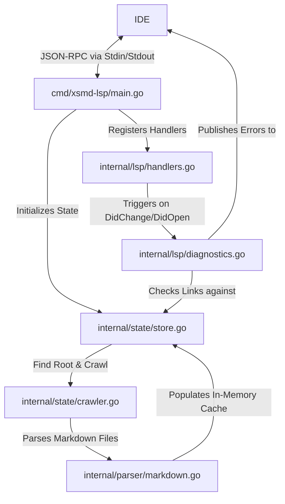

# LSP Architecture

This document describes the structure of the `xsmd-lsp` server.

## What is an LSP Server?

A **Language Server Protocol** (LSP) server
is a process that communicates with an IDE
using `stdin`/`stdout` over **JSON-RPC** .
It handles logic for code intelligence,
definitions,
folding,
and diagnostics,
keeping the editor interface decoupled from compilers/parsers.

## Component Overview

The system is split into three main packages to isolate components:

### Module Descriptions

- [main.go](/cmd/xsmd-lsp/main.go):
  Creates the server instance,
  registers handlers,
  and starts JSON-RPC standard input/output listeners.
- [internal/state/store.go](/internal/state/store.go):
  In-memory cache/store (`ServerState` and `DocumentInfo`).
  Houses cached Markdown files,
  link ranges,
  and titles.
- [internal/state/crawler.go](/internal/state/crawler.go):
  Anchors project roots by finding `xsmd.toml`
  and climbs the directory tree finding files.
- [internal/state/config.go](/internal/state/config.go):
  Parses `xsmd.toml` configuration options (such as debug mode and ignored directories).
- [internal/state/path.go](/internal/state/path.go):
  Helper functions to clean URIs and resolve root-relative/folder-relative links to absolute filesystem paths.
- [internal/parser/markdown.go](/internal/parser/markdown.go):
  Converts raw Markdown text into an Abstract Syntax Tree (AST),
  extracting titles and character spans of notes.
  Also defines shared structures like `LineOffsetTable` and position-based link lookup helpers.
- [internal/lsp/handlers.go](/internal/lsp/handlers.go):
  Configures LSP server capabilities
  (folding, definition, backreferences, autocompletions).
- [internal/lsp/diagnostics.go](/internal/lsp/diagnostics.go):
  Validates target paths against cache tables and the filesystem,
  generating highlights for broken links.

## Mutexes & Concurrency Safety

> [!IMPORTANT]
> Go uses lightweight threads (goroutines) to perform crawl indexation and handle requests concurrently.
> To prevent race conditions, a Read-Write Mutex (`sync.RWMutex`) guards all store map transactions:

- `Mu.Lock()` / `Mu.Unlock()`:
  Acquired during content parsing and file cache writes.
  Blocks all reads and writes until complete.
- `Mu.RLock()` / `Mu.RUnlock()`:
  Acquired during lookup requests (e.g. autocompletions, definitions).
  Allows multiple concurrent readers without blocking, but blocks edits.
