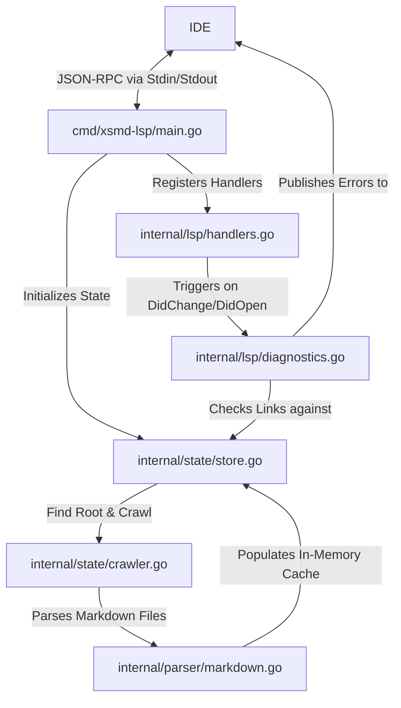

# LSP Architecture

This document describes the structure of the `xsmd-lsp` server.

## What is an LSP Server?

A **Language Server Protocol** (LSP) server is a process that communicates with an IDE.
It uses `stdin`/`stdout` over **JSON-RPC**.
It handles the logic for code intelligence, definitions, folding, and diagnostics.
This keeps the editor interface separate from the compilers and parsers.

## Component Overview

We split the system into three main packages to isolate the components:

```mermaid
graph TD
    Client[IDE] <-->|JSON-RPC via Stdin/Stdout| Main[cmd/xsmd-lsp/main.go]
    Main -->|Initializes State| State[internal/state/store.go]
    Main -->|Registers Handlers| LSP[internal/lsp/handlers.go]

    State -->|Find Root & Crawl| Crawler[internal/state/crawler.go]
    Crawler -->|Parses Markdown Files| Parser[internal/parser/markdown.go]
    Parser -->|Populates In-Memory Cache| State

    LSP -->|Triggers on DidChange/DidOpen| Diag[internal/lsp/diagnostics.go]
    Diag -->|Checks Links against| State
    Diag -->|Publishes Errors to| Client
```

### Module Descriptions

- [main.go](/cmd/xsmd-lsp/main.go):
  Creates the server instance. Registers the handlers. Starts the JSON-RPC standard input/output listeners.
- [internal/state/store.go](/internal/state/store.go):
  In-memory cache/store (`ServerState` and `DocumentInfo`).
  Stores the cached Markdown files, link ranges, and titles.
- [internal/state/crawler.go](/internal/state/crawler.go):
  Locates the project root by finding the anchor file `xsmd.toml`. Walks the directory tree to find files.
- [internal/state/config.go](/internal/state/config.go):
  Parses `xsmd.toml` configuration options (such as debug mode and ignored directories).
- [internal/state/path.go](/internal/state/path.go):
  Helper functions that clean URIs and resolve root-relative/folder-relative links to absolute filesystem paths.
- [internal/parser/markdown.go](/internal/parser/markdown.go):
  Converts raw Markdown text into an Abstract Syntax Tree (AST). Extracts the titles and character spans of notes. Defines shared structures such as `LineOffsetTable` and position-based link-lookup helpers.
- [internal/lsp/handlers.go](/internal/lsp/handlers.go):
  Configures LSP server capabilities
  (folding, definition, backreferences, autocompletions).
- [internal/lsp/diagnostics.go](/internal/lsp/diagnostics.go):
  Validates the target paths against the cache tables and the filesystem. Generates highlights for broken links.

## Mutexes & Concurrency Safety

> [!IMPORTANT]
> Go uses lightweight threads (goroutines) to crawl and index the workspace. The goroutines also handle requests concurrently.
> To prevent race conditions, a Read-Write Mutex (`sync.RWMutex`) guards all store map transactions:

- `Mu.Lock()` / `Mu.Unlock()`:
  The server acquires these locks during content parsing and file cache writes.
  The locks block all reads and writes until the operation completes.
- `Mu.RLock()` / `Mu.RUnlock()`:
  The server acquires these locks during lookup requests (for example, autocompletions and definitions).
  The locks allow multiple concurrent readers. The locks block edits.
