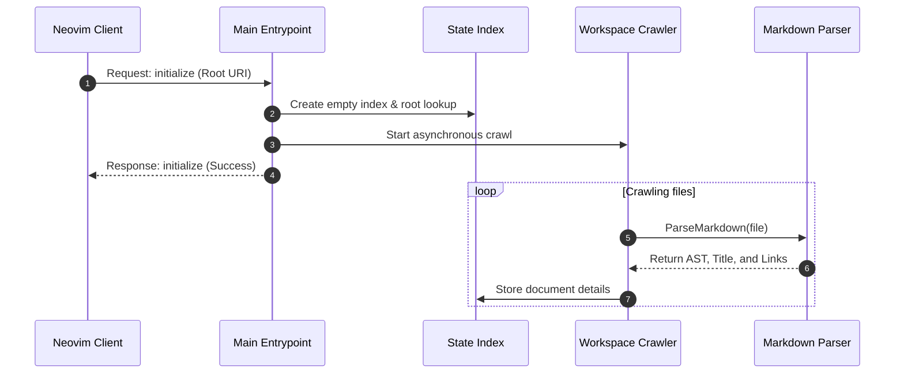
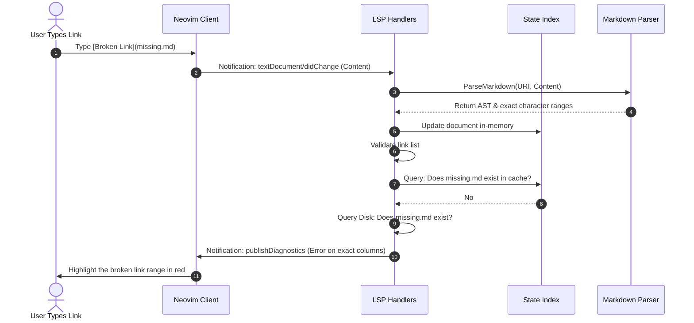

# LSP Execution Flows

This document details the step-by-step transaction sequences of the server during boot and runtime editing.

---

## 1. Booting & Crawling the Workspace

When Neovim launches and initializes the client connection, the server discovers the vault root and indexes Markdown content asynchronously:

---

## 2. Real-Time Diagnostics (Link Validation)

As you switch buffers or edit notes, the server validates links in the background:

---

## 3. Precise Link Character Positioning

To prevent diagnostics or rename actions from bleeding into neighboring text, the parser calculates the **exact byte offsets** of links in the source document rather than mapping bounds to the parent line:

1. **AST Node Lookup**: Detects a link node (`ast.KindLink`) during traversal.
2. **Sequential Search**: Matches pattern `](destination)` starting from the last matched offset.
3. **Offset Resolution**: Scans backwards for the corresponding `[` bracket to frame the absolute start.
4. **Column Calculation**: Computes exact start/end line coordinates and characters relative to the row's newline bytes.
