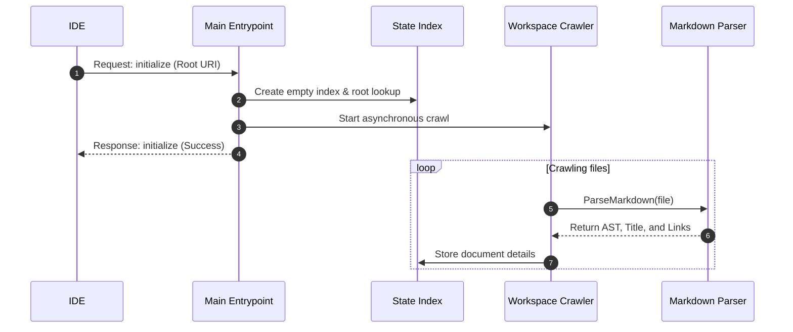
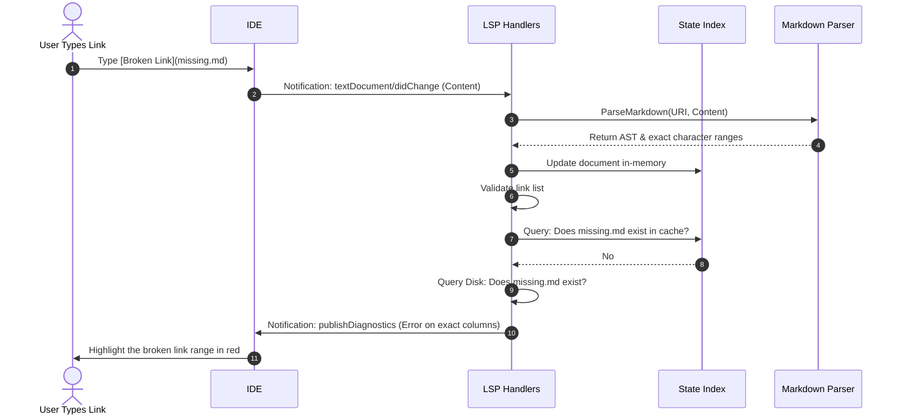

# LSP Execution Flows

## Booting

When the IDE initializes the client connection,
the server finds the root,
loads the `xsmd.toml` configuration,
and indexes Markdown content asynchronously:

## Link Validation

As you switch buffers or edit notes,
the server validates links in the background:

## Precise Link Character Positioning

The parser calculates the **exact byte offsets** of links in the source document:

1. AST Node Lookup:
   Detects a link node (`ast.KindLink`) during traversal.
2. Sequential Search:
   Matches pattern `](destination)` starting from the last matched offset.
3. Offset Resolution:
   Scans backwards for the corresponding `[` bracket to frame the absolute start.
4. Column Calculation:
   Computes exact start/end line coordinates and characters relative to the row's newline bytes.

This prevents diagnostics or rename actions from bleeding into neighboring text.
The sequential search and coordinate logic is centralized in the `parser.FindLinkAtPosition` helper.

## Link Resolution Strategy

When resolving Markdown links across Definition lookup,
references search, diagnostics, and renaming,
all path calculations are unified and executed under
the `ResolveLinkPath` and `CleanURIPath` helper methods in
[internal/state/path.go](/internal/state/path.go):

- Root-Relative Links (e.g. `[Note](/docs/note.md)`):
  - Detected when the destination path starts with `/`.
  - The leading `/` is stripped and the clean path is joined with the **Workspace Root**.
- Folder-Relative Links (e.g. `[Note](../note.md)` or `[Note](sibling.md)`):
  - Detected when the destination path does _not_ start with `/`.
  - The path is resolved relative to the parent directory of the file containing the link.
- Autocompletion:
  - Supports two trigger patterns:
    - `[`
    - `(` inside an existing link (e.g., `[Label](`)
