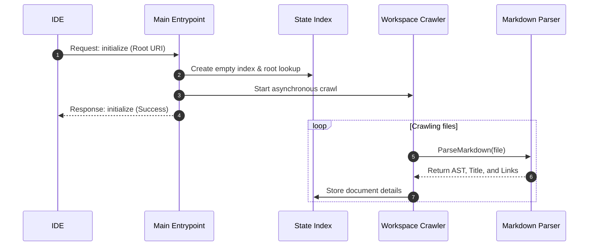
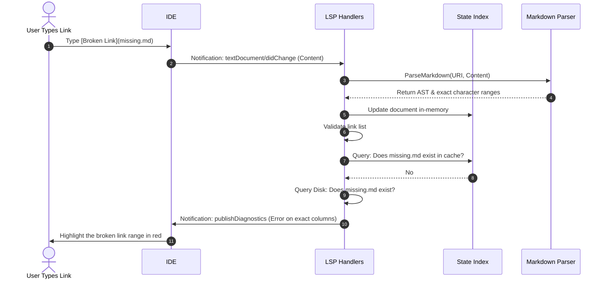
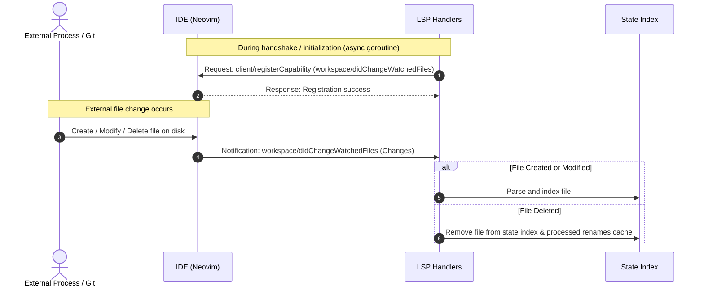

# LSP Execution Flows

## Booting

When the IDE initializes the client connection, the server finds the root.
The server loads the `xsmd.toml` configuration and indexes the Markdown content asynchronously:

```mermaid
sequenceDiagram
    autonumber
    participant Editor as IDE
    participant Main as Main Entrypoint
    participant State as State Index
    participant Crawler as Workspace Crawler
    participant Parser as Markdown Parser

    Editor->>Main: Request: initialize (Root URI)
    Main->>State: Create empty index & root lookup
    Main->>Crawler: Start asynchronous crawl
    Main-->>Editor: Response: initialize (Success)

    loop Crawling files
        Crawler->>Parser: ParseMarkdown(file)
        Parser-->>Crawler: Return AST, Title, and Links
        Crawler->>State: Store document details
    end
```

## Link Validation

As you switch buffers or edit notes,
the server validates links in the background:

```mermaid
sequenceDiagram
    autonumber
    actor User as User Types Link
    participant Editor as IDE
    participant Server as LSP Handlers
    participant State as State Index
    participant Parser as Markdown Parser

    User->>Editor: Type [Broken Link](missing.md)
    Editor->>Server: Notification: textDocument/didChange (Content)
    Server->>Parser: ParseMarkdown(URI, Content)
    Parser-->>Server: Return AST & exact character ranges
    Server->>State: Update document in-memory
    Server->>Server: Validate link list
    Server->>State: Query: Does missing.md exist in cache?
    State-->>Server: No
    Server->>Server: Query Disk: Does missing.md exist?
    Server->>Editor: Notification: publishDiagnostics (Error on exact columns)
    Editor->>User: Highlight the broken link range in red
```

## Precise Link Character Positioning

The parser calculates the **exact byte offsets** of links in the source document:

1. AST Node Lookup:
   Detects a link node (`ast.KindLink`) during traversal.
2. Sequential Search:
   Matches pattern `](destination)` from the last matched offset.
3. Offset Resolution:
   Scans backward for the corresponding `[` bracket. The bracket marks the absolute start.
4. Column Calculation:
   Computes exact start/end line coordinates and characters relative to the newline bytes of the row.

The exact offsets prevent diagnostics and rename actions from affecting the neighboring text.
We centralize the sequential search and coordinate logic in the `parser.FindLinkAtPosition` helper.

## Link Resolution Strategy

All path calculations use the `ResolveLinkPath` and `CleanURIPath` helper methods in [internal/state/path.go](/internal/state/path.go).
The methods apply to definition lookup, reference search, diagnostics, and renaming:

- Root-relative links (for example, `[Note](/docs/note.md)`):
  - The server detects a root-relative link when the destination path starts with `/`.
  - The server removes the leading `/` and joins the clean path with the workspace root.
- Folder-relative links (for example, `[Note](../note.md)` or `[Note](sibling.md)`):
  - The server detects a folder-relative link when the destination path does not start with `/`.
  - The server resolves the path relative to the parent directory of the file that contains the link.
- Autocomplete: It supports two trigger patterns: `[`, and `(` inside an existing link (for example, `[Label](`).

## Real-Time Workspace Synchronization

The server registers a filesystem watcher dynamically. The watcher keeps its index in sync with external file changes:

```mermaid
sequenceDiagram
    autonumber
    actor External as External Process / Git
    participant Editor as IDE (Neovim)
    participant Server as LSP Handlers
    participant State as State Index

    Note over Editor,Server: During handshake / initialization (async goroutine)
    Server->>Editor: Request: client/registerCapability (workspace/didChangeWatchedFiles)
    Editor-->>Server: Response: Registration success

    Note over External,Editor: External file change occurs
    External->>Editor: Create / Modify / Delete file on disk
    Editor->>Server: Notification: workspace/didChangeWatchedFiles (Changes)

    alt File Created or Modified
        Server->>State: Parse and index file
    else File Deleted
        Server->>State: Remove file from state index & processed renames cache
    end
```
